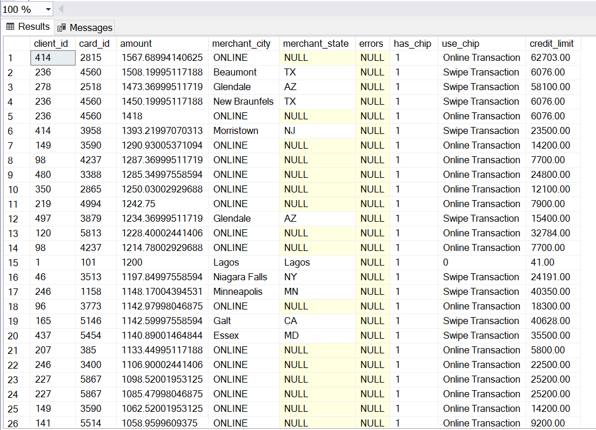
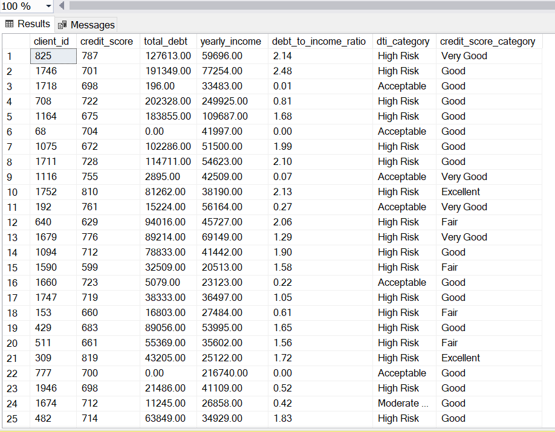
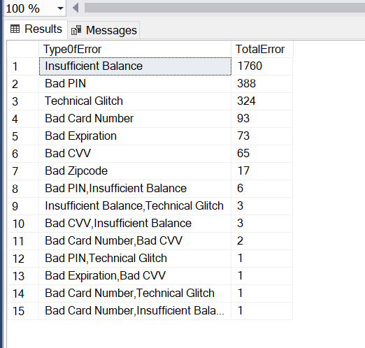
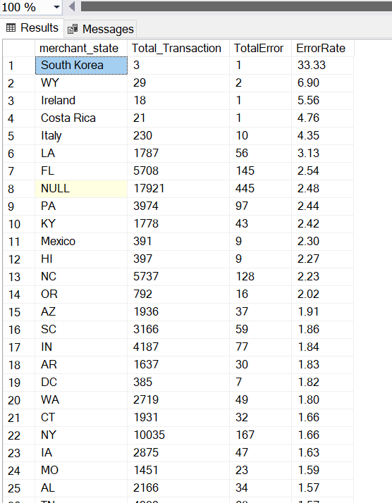
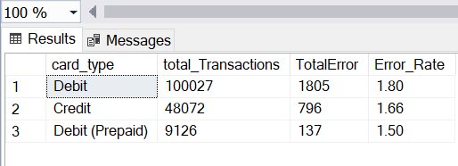

# Credit-Risk-Analysis-for-Tawny-Bank

## Introduction

This project focuses on delivering strategic insights to Tawny Bank by analyzing customer demographics, credit behavior, and transaction patterns. Leveraging data from multiple sources users, credit cards, transactions, and merchant categories the analysis aims to evaluate financial health, detect fraud risks, and support personalized engagement strategies. Using SQL for data preparation and Power BI for visualization, the project provides a comprehensive view of customer profiles and risk indicators to drive data-informed decision-making.

## About The Dataset

 Dataset Description

The dataset used for this analysis is composed of four primary tables, each representing a critical component of the banking ecosystem:

1. users_data – Customer Information
   
This table contains detailed demographic and financial information for each user.

Field	Description

|  |  | 
|----------|----------|
| id (Primary Key)  | Unique identifier for each user 
| current_age  |  Current age of the user 
| retirement_age |  Declared retirement age of the user 
|  birth_year  |  Year of birth for the user 
| gender	  |  Gender of the user ( male or female) 
| address |  Residential address of the user 
| latitude | Latitude of the user’s residence      
| longitude | 	Longitude of the user’s residence 
| per_capita_income  |  Per capita income of the user  
| yearly_income  |  Total yearly income of the user 
| total_debt |  Total amount of debt owed by the user 
| credit_score  |  Credit score rating of the user 
| num_credit_cards | Number of credit cards owned by the user 
| current_age  |  retirement_age	Age details   

2. cards_data – Card Attributes
   
This table links each card to a user and describes its properties.

|  |  | 
|----------|----------|
| id (Primary Key)  |  Unique identifier for each credit card
| client_id (Foreign Key to users_data.id)  | Identifier linking the card to its owner in the users_data table
| card_brand  |  Brand or issuer of the credit card (e.g., Visa, Mastercard)
| card_type  |  Type/category of the card (e.g., debit, credit, etc.)
| card_number  |   Unique number on the credit card
| expires  |   Expiry date of the credit card
| card_number  |   Unique number on the credit card	
| cvv  |   Security code of the card
| has_chip	 |  Boolean/Flag indicating if the card has an EMV chip
| num_cards_issued  |  Total number of cards issued for the same account
| credit_limit  |   Credit limit assigned to the card
| acct_open_date  |   Date the credit card account was opened
| year_pin_last_changed | Year the card’s PIN was last changed

3. transactions_data – Transaction Records
   
This table captures every transaction made using a card.

|  |  | 
|----------|----------|
| id (Primary Key)    | Unique identifier for each transaction
| date    | Date of the transaction
| client_id (Foreign Key to users_data.id)    | Identifier linking the transaction to the user in the users_data table
| card_id (Foreign Key to cards_data.id)  | Identifier linking the transaction to the respective card in the cards_data table
| amount   | Transaction amount in the respective currency     
| use_chip   | Boolean/Flag indicating if the chip was used during the transaction
| merchant_id |  Unique identifier of the merchant
| merchant_city   | City where the merchant is located  
| merchant_state   | State where the merchant is located   
| zip    | ZIP code of the merchant's location 
| mcc (Foreign Key to mcc_codes.mcc_id)    | Merchant Category Code representing the type of merchant or transaction.
| errors   | Any errors encountered during the transaction (if any)  

4. mcc_codes – Merchant Categories

This table categorizes merchants based on their business type.

|  |  | 
|----------|----------|
| mcc_id (Primary Key)    | Unique identifier for each Merchant Category Code  
| Description   | Description of the merchant category (e.g., grocery, travel, entertainment)

# Tool and Concept 
#### SQL
#### SQL Server
#### Data Exploration
#### Aggregation
#### Triggers
#### CTE

## Objective

To uncover critical insights into customer financial health, credit risk, and transactional anomalies by analyzing integrated datasets from users, credit cards, transactions, and merchant categories. The goal was to support decision making across fraud detection, and risk management at Tawny Bank. The object of the analysis was further broken down to include:

Understand Customer Profiles & Financial Health

• Segment customers by age, gender, location, credit score, and debt-to-income ratio

• Identify high-risk and financially stable customer groups for targeted engagement

Evaluate Transaction Behavior & Patterns

• Analyze spending by merchant category, location, and payment method (chip, swipe, online)

• Track high-value transactions and out-of-state activity to identify abnormal behavior

Detect and Prevent Fraud

• Implement logic to flag suspicious patterns like chip bypass, consecutive transaction failures, and online transaction bursts

• Create real-time triggers to log potentially fraudulent activity for early intervention

Assess Transaction System Reliability

• Measure and compare error rates across card types, regions, and error categories

• Highlight technical or process inefficiencies affecting the customer experience

Support Data-Driven Decisions

• Provide actionable insights for risk management, customer engagement, and operational improvement

• Deliver visual, interpretable outputs (e.g., Power BI dashboards) to inform stakeholders

## Discussion And Insight

   #### Transaction Above $1000 done without chip even though the card is chip enabled.
     SELECT 
         t.client_id,
     	t.card_id,
     	t.amount,
     	t.merchant_city,
     	t.merchant_state,
     	t.errors,
     	c.has_chip,
     	t.use_chip,
     	c.credit_limit
         FROM transactions_data t 
         INNER JOIN cards_data c ON t.card_id = c.id
     WHERE t.amount >= 1000  AND t.use_chip <> 'Chip Transaction' AND c.has_chip = 1
     ORDER BY t.amount DESC;

Cards equipped with EMV chips are designed to offer stronger fraud protection than swipe or online transactions. So when chip-enabled cards are repeatedly used for Swipe Transactions (vulnerable to cloning) and Online Transactions (vulnerable to interception/card-not-present fraud) it raises a red flag. A large number of transactions in analysis are either “Online Transaction” or “Swipe Transaction”, despite all cards has chip. This means chip functionality is not being used, even when available.Example: Card IDs 4560, 4237, 3590, 1145 are involved in multiple non-chip transactions.

Interestingly, all of these transactions are successful, which could mask underlying fraud (fraud systems may not detect these immediately) Indicate a need to update fraud detection logic to include contextual flags like this one.  More so several of these transactions exceed $1,000–$1,500, which is non-trivial — and in aggregate, they pose a potential monetary risk if fraudulent. For example: Client 236 transacts $1508.19 (Online), despite chip-enabled card. Client 149 transacts $1290.93 (Online), same situation.

Some transactions occurred in places like TX, AZ, Lagos, and several with merchant_state as NULL — this may suggest:Remote or untraceable merchants Possible manipulation or incomplete logging — which makes traceability harder and fraud more likely

## Anti Fraud Logic and Triggers

##### Flag  more than 3 transactions done with an hour online at different locations and where the amount was increased per transaction

     WITH ordered_txn AS (
         SELECT
             t1.id,
             t1.card_id,
             t1.client_id,
             t1.date,
             t1.amount,
             t1.merchant_state,
             t1.merchant_city,
             (
                 SELECT COUNT(*)
                 FROM transactions_data t2
                 WHERE t2.card_id = t1.card_id
                   AND t2.merchant_city = 'Online'
                   AND DATEDIFF(MINUTE, t2.date, t1.date) BETWEEN 0 AND 60
             ) AS txn_count,
             (
                 SELECT COUNT(DISTINCT t2.merchant_city)
                 FROM transactions_data t2
                 WHERE t2.card_id = t1.card_id
                   AND t2.merchant_city = 'Online'
                   AND DATEDIFF(MINUTE, t2.date, t1.date) BETWEEN 0 AND 60
             ) AS distinct_locations,
             LAG(t1.amount) OVER (PARTITION BY t1.card_id ORDER BY t1.date) AS prev_amount
         FROM transactions_data t1
         WHERE t1.merchant_city = 'Online'
     )
     SELECT *
     FROM ordered_txn
     WHERE txn_count > 3
       AND distinct_locations > 1
       AND amount > ISNULL(prev_amount, 0)
     ORDER BY card_id, date;
     
As part of the transactional risk analysis for the Bank, I developed a targeted SQL routine designed to identify suspicious online spending behavior that may signal potential card compromise, both activity, or coordinated fraud attempts.The logic focuses specifically on: Online transactions on the same card within a short time frame (60 minutes) across more than one merchant location	and with a pattern of increasing transaction amounts. I flag any card that has more than three online transactions within one hour, where the transactions originate from multiple merchant cities and the transaction amount increases relative to the previous one. This pattern is a classic indicator of card testing, where fraudsters initiate small transactions to validate a compromised card, use different online merchant routes or IPs and gradually escalate the amount once initial transactions succeed. This detection strategy helps us; Identify compromised cards early before larger fraudulent losses occur, detect automated or bot-driven attacks exploiting online platforms and Surface geographic inconsistencies in transaction behavior (e.g., multiple locations in one hour is highly unlikely for a legitimate customer)

More importantly, this rule applies only to cards equipped with EMV chips, yet used in non-chip channels like online, where security is inherently lower. The business implications of this is that: A reduce fraud-related financial exposure, improves cardholder trust by proactively securing accounts and supports compliance with industry best practices for transaction monitoring. 

#### TRIGGER(To automatically detect and log suspicious card transactions where a card that has a chip is not used via chip during a transaction)

     CREATE TABLE transaction_trigger_log (
         log_id INT IDENTITY(1,1) PRIMARY KEY,
         transaction_date DATETIME,
         client_id INT,
         card_id INT,
         amount DECIMAL(18, 2),
         merchant_city VARCHAR(255),
         merchant_state VARCHAR(255),
         has_chip BIT,
         used_chip VARCHAR(255) ,
         is_fraud_suspected BIT,
         logged_at DATETIME DEFAULT GETDATE()
     );
     CREATE TRIGGER trg_flag_chip_bypass
     ON transactions_data
     AFTER INSERT
     AS
     BEGIN
         SET NOCOUNT ON;
     
         INSERT INTO transaction_trigger_log (
             transaction_date,
             client_id,
             card_id,
             amount,
             merchant_city,
             merchant_state,
             has_chip,
             used_chip,
             is_fraud_suspected
         )
         SELECT 
             i.date,
             i.client_id,
             i.card_id,
             i.amount,
             i.merchant_city,
             i.merchant_state,
             c.has_chip,
             i.use_chip,
             1  -- Flag as fraud suspected
         FROM inserted i
         INNER JOIN cards_data c ON i.card_id = c.id
         WHERE c.has_chip = 1 AND i.use_chip <> 'Chip Transaction'
     END;
     
     DROP TRIGGER trg_flag_chip_bypass;
     DROP TABLE transaction_trigger_log;
     
     INSERT INTO transactions_data (
         id, date, client_id, card_id, amount,
         use_chip, merchant_id, merchant_city,
         merchant_state, zip, mcc, errors
     )
     VALUES (
         201, GETDATE(), 1, 101, 1200.00,
         0, 3001, 'Lagos', 'Lagos', '100001', 1234, NULL
     );

     SELECT * FROM transaction_trigger_log;

As to  mitigation fruadulent activities experienced by the bank, I implemented a SQL Server trigger designed to automatically monitor and log suspicious card transactions specifically cases where chip enabled cards are not used via chip. This logic is built on the premise that EMV chip technology offers significantly higher protection against fraud compared to magnetic stripe (swipe) or card-not-present (online) transactions. When a card equipped with a chip is used in a non-chip transaction, it potentially indicates: card cloning (especially if swiped), unauthorized online use and customer behavior deviation. This logic helps to detects risky behavior as it happens, not post-fraud , targets one of the most common fraud vectors and builds a centralized log of potentially fraudulent events for review and machine learning enrichment among others. 

#### Block Cards  With Than 3 Consecutive Failed Transactions I in a Day. 

     WITH TransactionErrors AS (
         SELECT 
             card_id,
             CAST([date] AS DATE) AS txn_date,
             [date] AS txn_datetime,
             errors,
             CASE 
                 WHEN errors IS NOT NULL AND errors <> '' THEN 1 
                 ELSE 0 
             END AS is_error
         FROM transactions_data
     ),
     
     ErrorGroups AS (
         SELECT *,
             ROW_NUMBER() OVER (PARTITION BY card_id, txn_date ORDER BY txn_datetime) 
             - 
             ROW_NUMBER() OVER (PARTITION BY card_id, txn_date, is_error ORDER BY txn_datetime) 
             AS group_id
         FROM TransactionErrors
     ),
     
     ConsecutiveErrorCounts AS (
         SELECT 
             card_id,
             txn_date,
             group_id,
             COUNT(*) AS consecutive_error_count
         FROM ErrorGroups
         WHERE is_error = 1
         GROUP BY card_id, txn_date, group_id
     )
     
     -- Final blocked cards
     SELECT DISTINCT 
         card_id,
         txn_date,
         'BLOCKED' AS status_reason
     FROM ConsecutiveErrorCounts
     WHERE consecutive_error_count >= 3;

Lastly, I created a logic that identifies credit cards that have experienced more than 3 consecutive failed transactions within a single day. These repeated failures can indicate; Potential fraud attempts (e.g., brute-force PIN guessing), stolen card misuse, malfunctioning or misconfigured cards or terminals and system abuse or bot activity. By flagging consecutive failures, this logic detects fraud-in-progress, allowing the bank to block the card before a successful fraudulent transaction occurs.

#### Customer Credit Risk Segmentation Based on Debt-to-Income Ratio and Credit Score Categories

     SELECT 
         id AS client_id,
         credit_score,
         total_debt,
         yearly_income,
       
         -- Debt-to-Income Ratio
         CAST(total_debt * 1.0 / NULLIF(yearly_income, 0) AS DECIMAL(6,2)) AS debt_to_income_ratio,
     
         -- DTI Risk Category
         CASE 
             WHEN (total_debt * 1.0 / NULLIF(yearly_income, 0)) < 0.36 THEN 'Acceptable'
             WHEN (total_debt * 1.0 / NULLIF(yearly_income, 0)) BETWEEN 0.36 AND 0.49 THEN 'Moderate Risk'
             WHEN (total_debt * 1.0 / NULLIF(yearly_income, 0)) >= 0.50 THEN 'High Risk'
             ELSE 'Unknown'
         END AS dti_category,
     
         -- Credit Score Category
         CASE 
             WHEN credit_score >= 800 THEN 'Excellent'
             WHEN credit_score >= 740 THEN 'Very Good'
             WHEN credit_score >= 670 THEN 'Good'
             WHEN credit_score >= 580 THEN 'Fair'
             ELSE 'Poor'
         END AS credit_score_category
     
     FROM users_data
     WHERE yearly_income > 0;

 

Over 70% of the customers fall into the High Risk category based on their debt-to-income (DTI) ratio, which is defined as the ratio of total debt to yearly income. This suggests that most customers have significant debt relative to their income, often with DTI values exceeding 1.0, and in some cases as high as 2.5. These customers may be financially strained, increasing the likelihood of missed payments or default. This insight is vital for risk management teams, who can prioritize these individuals for monitoring, intervention, or restructuring.

Several customers have "Good" or even "Very Good" credit scores, yet are flagged as High Risk due to excessive debt. For example: Client 708 has a credit score of 722, but a DTI of 0.81 Client 1711 has a credit score of 728, but a DTI of 2.10This discrepancy highlights the limitations of relying solely on credit scores for risk assessments.

Only a small number of customers fall into the Acceptable DTI range (< 0.36). These customers are more likely to be financially stable and have a better capacity to manage credit responsibly. Example: Client 1116 has a DTI of 0.07 and a Very Good credit score. These customers are ideal targets for premium credit products, credit line increases, or investment services.

Some customers present unique profiles worth noting: Client 68: Has no debt and a Good credit score possibly a new customer or one who recently paid off their obligations. Client 777: Has zero debt and a very high income ($216,740) but only a credit score of 700s  an opportunity to upsell premium cards or investment products.

Some customers manage to maintain good credit scores despite very high DTI, indicating they are likely making payments on time  but they are still overleveraged. These are vulnerable to economic shocks (e.g., job loss, inflation) and could shift from good payers to defaulters quickly.

#### Most Common Card Errors

     SELECT 
         errors AS Type0fError,
         COUNT(*) AS TotalError
     FROM transactions_data
     WHERE errors IS NOT NULL AND errors <> ''
     GROUP BY errors
     ORDER BY TotalError DESC;

Over 70% of all transaction errors are due to “Insufficient Balance”   This indicates that a large number of customers are attempting transactions beyond their available funds or credit limits. Next to that is Authentication Failures Signal Possible Fraud Attempts such as Bad PIN and Bad CVV errors. These are typical in unauthorized usage or brute-force attempts. While some may be user error, repeated failures—especially when combined may point to card testing or fraud. Other technical errors include bad card numbers and expired card attempts. These could be caused by POS system incompatibilities, merchant-side failures, or data formatting issues. However, the risk here is that this undermines customer trust and contributes to failed transactions that can impact revenue.

#### Error Rate By City/State

     SELECT 
        t.merchant_state,
         COUNT(*) AS Total_Transaction,
         SUM(CASE WHEN errors IS NOT NULL AND errors <> '' THEN 1 ELSE 0 END) AS TotalError,
         CAST(SUM(CASE WHEN errors IS NOT NULL AND errors <> '' THEN 1 ELSE 0 END) * 100.0 / 
     	COUNT(*) AS DECIMAL(5,2)) AS ErrorRate
     FROM transactions_data t
     GROUP BY merchant_state
     ORDER BY ErrorRate DESC; 8.png
     
     
 
     
Regions such as South Korea (33.33% error rate), Wyoming (WY) (6.90%), and Ireland (5.56%) report notably high error percentages. However, it’s important to emphasize that these regions also recorded very low transaction volumes, which means; the high error rates may not be statistically significant and the data could be skewed by a small number of problematic.  States such as Alabama (1.57%), Missouri (1.59%), Iowa (1.60%), and New York (1.66%) show consistently low error rates, despite handling a large number of transactions. This suggests; Stable processing environments, potentially stronger merchant infrastructure and more mature payment systems in these areas

#### Error Rate By Card Type
   
     SELECT 
         c.card_type,
         COUNT(*) AS total_Transactions,
         SUM(CASE WHEN t.errors IS NOT NULL AND t.errors <> '' THEN 1 ELSE 0 END) AS TotalError,
         CAST(SUM(CASE WHEN t.errors IS NOT NULL AND t.errors <> '' THEN 1 ELSE 0 END) * 100.0 /
     	COUNT(*) AS DECIMAL(5,2)) AS Error_Rate
     FROM transactions_data t
     JOIN cards_data c ON t.card_id = c.id
     GROUP BY c.card_type
     ORDER BY Error_Rate DESC;

All card types have error rates below 2%, which suggests that our core transaction processing infrastructure is fundamentally stable and performing well.While the error rate is relatively low, the high volume of debit card usage makes even small inefficiencies impactful at scale.Credit cards perform slightly better than debit, suggesting more consistent authorizations or fewer user-related issues (e.g., overdraft limits).Prepaid cards outperform others, which may be due to stricter limits, preloaded balances, or simplified processing paths.

## Recommendation

•	Block cards after 3+ consecutive failed transactions per day

•	Flag chip-enabled cards used via swipe or online as potential fraud

•	Detect multiple online transactions within 1 hour from different locations

•	Monitor repeated bad PIN/CVV attempts for card compromise

•	Focus on debit card error reduction — high volume, highest error rate (1.80%)

•	Benchmark prepaid card systems — lowest error rate (1.50%) despite tighter limits

•	Identify and monitor users with high DTI + poor credit scores

•	Target financially healthy customers for premium offers

•	Segment customers by behavior, not just credit score

•	Investigate high-error regions (e.g., South Korea, Wyoming) cautiously due to low volume

•	Audit NULL merchant location data (17,000+ records) for better risk visibility

•	Use low-error regions (e.g., AL, MO, NY) as system reliability benchmarks

•	Keep fraud trigger logs active for chip bypass detection

•	Monitor monthly error trends across card types and locations

•	Align fraud sensitivity with seasonal transaction spikes

## Conclusion

This project provided a comprehensive analysis of Aurora Bank’s customer behavior, transaction performance, credit risk, and fraud exposure. Through in-depth segmentation, error tracking, and fraud detection logic, we uncovered actionable insights to strengthen security, improve operational efficiency, and support data-driven decision-making. By combining technical rigor with strategic recommendations, this analysis equips the bank with the tools to enhance customer trust, reduce risk, and optimize transaction reliability across all card types and regions.

